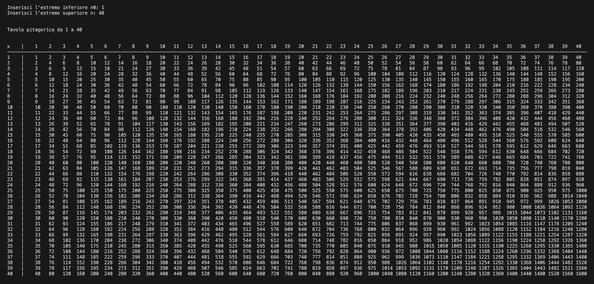
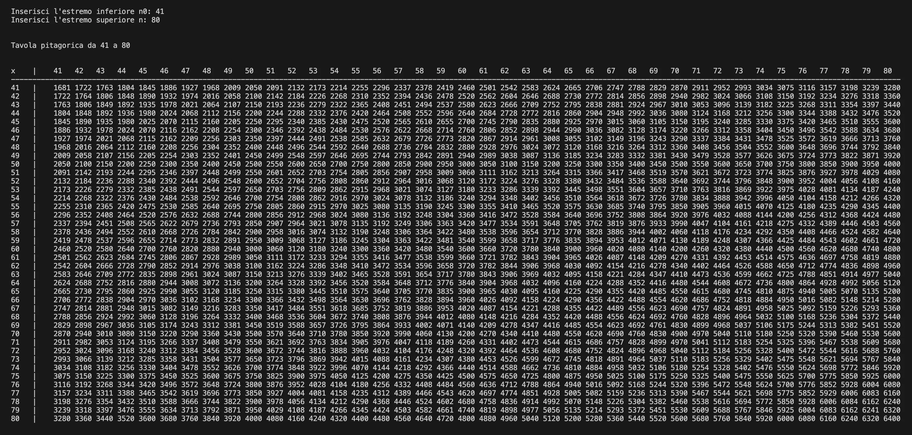

# Multiplication Table

Multiplication table generator for integer values between two bounds n₀ and n chosen by the user, developed in Java.

For a full description of the implementation, read the article on chorax.it: [Programmare in Java: 2. Tavola Pitagorica](https://chorax.it/codice-e-creativita/programmare-in-java-2-tavola-pitagorica/)

## How it works

The program displays a formatted multiplication table with headers and grid. The layout is computed dynamically based on the values entered: column widths, separators and the corner symbol `x` are all aligned automatically to match the actual output size.

Key features:

- Input validation: type checking, overflow detection, positive integer and n > n₀ constraints, with a maximum of 5 attempts
- Overflow prevention on n × n
- Dynamic layout: column width calculated from the number of digits of the largest value
- Precise automatic alignment of numbers, headers, separators and the `x` corner symbol

Mathematical convention: ℕ = {1, 2, 3, …} (Bourbaki).

## Result

<div align="center">
  
  <br><br>
  
</div>

## Requirements

- Java JDK 8+
- Console or IDE with UTF-8 support

## Usage

Compile and run:

```
javac Tavola_pitagorica.java
java Tavola_pitagorica
```

Enter the lower bound n₀ and the upper bound n when prompted. The program will display the multiplication table for all integers in [n₀, n].

## License

© 2025 Alessio Severi — released under the [MIT License](LICENSE).
